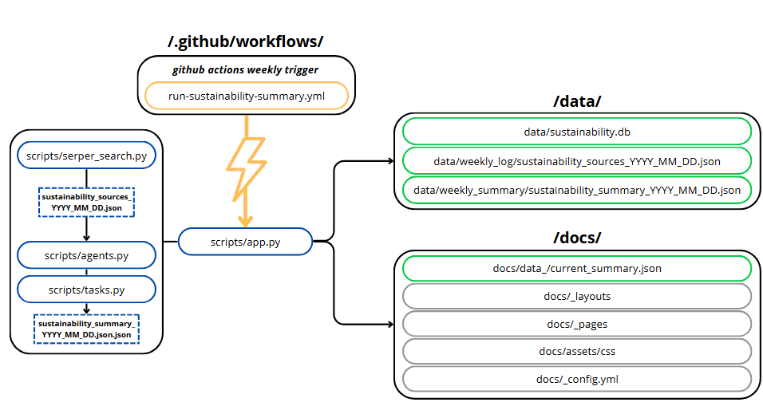

# Exam_MLOps_MFE

https://mathias1801.github.io/Exam_MLOps_MFE/ 

# Application Setup
The application utilizes github actions to run a pipeline set up to fetch news related to the sustainability cause relevant to businesses. The main pipeline is driven via the `app.py` which utilizes the backend scripts to update data for the frontend of things.

## Backend
The backend process starts with `serper_search.py` which utilizes the web scraping tool `Serper`, which is a google web scraping API. Here some specific sources are provided to influence the web scraping in terms of the sources of `EEA` while a query for unspecified sources is also utilized to find outside sources in general as well. For the purpose of this repository these query metrics are hardcoded, however in the future one could imagine it being dynamic query parameters decided by the user of the application. These found sources are stored in a `.json` format in the `data/weekly_log/` folder as well as in the table `source_log` in the database `sustainability.db` where each individual source is a separate row.

After these sources are found the next part of the backend process is utilizing an agentic LLM system to treat these sources into a readable resume filtering irrelevant information out. The `summarize_agent` in `agent.py` with the task `summarize_task` in `tasks.py` has specific instructions set in place in terms of role and function, as well as how to treat the given information with an n-shot approach in prompt engineering, as we have provided a singular example of how to quantify the sources into relevant readable information in hopes that the LLM provides similar levels of summarizations going forwards. This part of the process is important as it dictates a usable format going forwards, which we more or less, want to be similar in nature for the users in the future. The application is best if the contents are more or less similar, especially considering potential data analytic efforts on the stored data of the summaries.

The next part of the agentic system is the ‘business_alignment_agent’ with the task ‘business_alignment_task’. Here a predefined content ‘company_profile’ is set, which in its current form is hard coded information, but in the future is expected to become defined by user inputs. This ‘company_profile’ is background information set in place to tailor the output to be of more relevance to the company using the tool. Here we use a chain of thoughts structure to prompt engineer the response as we request that the model goes over three distinct thoughts when providing its response.

The output of the agentic system is saved as a `.json` file in `data/weekly_summary/` as well as overwriting the file `current_summary.json` in `docs/_data/` as this dictates the contents of the frontend github page, where we want the most recent search data presented. The same goes for ‘current_consultancy.json’ in ‘docs/_data/’ and ‘.json’ in ‘data/weekly_consultation/’. The information is also passed to `sustainability.db` in the tables `summary_reports` and ‘consultancy’ respectively. The LLMs are prompted to use markdown in their responses meaning that the layout is nicely formatted on the webpage as well.

These backend components are called in the `app.py` script which via github actions dictated in the YAML file `.github/workflows/run-sustainability-summary.yml` is called once a week. This YAML file has permissions to add and overwrite existing data in the repository, hence how new data is managed and added to the system once a week. The `app.py` serves the purpose of tying the aforementioned scripts together, as it builds a bridge between the Serper searches and the agentic LLM system, while passing the information into the relevant storage folders.

The outputs of `app.py` are passed to folders `data/` and `docs/_data/` as well as `sustainability.db`. The structure of `sustainability.db` is two tables `summary_reports` and `source_log` table which can be seen here:

### `summary_reports`:
| Column Name | Type     | Description                                 |
|-------------|----------|---------------------------------------------|
| `id`        | INTEGER  | Auto-incrementing primary key               |
| `date`      | TEXT     | Date of the summary (e.g., `2025-04-09`)    |
| `content`   | TEXT     | The full summary text                       |

### `source_log`:
| Column Name   | Type     | Description                                           |
|---------------|----------|-------------------------------------------------------|
| `id`          | INTEGER  | Auto-incrementing primary key                         |
| `report_date` | TEXT     | Date of the associated summary                        |
| `title`       | TEXT     | Title of the article/source                           |
| `date`        | TEXT     | Publication date of the article (if available)       |
| `link`        | TEXT     | URL to the article or source                          |
| `snippet`     | TEXT     | Short summary or snippet from the article             |
| `text`        | TEXT     | Full scraped article text (if available)              |
| `source_type` | TEXT     | Either `"serper"` or `"eea"`                          |

### `consultancy`:
| Column Name   | Type     | Description                                           |
|---------------|----------|-------------------------------------------------------|
| `id`          | INTEGER  | Auto-incrementing primary key                         |
| `date`      | TEXT     | Date of the summary (e.g., `2025-04-09`)    |
| `content`   | TEXT     | The full consultancy text                       |

## Frontend
For the frontend purposes html and css is utilized in extension with github pages, which provides a hosted webpage with multiple tabs. The html and css is found in the `docs/` folder which holds subfolders `/_data/`, `/_layouts/`, `/_pages/`, `assets/css/`. 

In the subfolder `/_data/` you will find the file `current_summary.json`, which holds the content for the page `Weekly News`. This `.json` file is automatically updated via the github actions that activates `app.py` which overwrites the `current_summary.json` that holds the summarization of the scraped articles. The same logic is applied to the ‘Business Consultancy’ page, that utilizes ‘current_consultancy.json’ for its contents. In subfolders `/_layouts/`, `/_pages/`, `assets/css/` you will find code that dictates content of the static pages, as well as the code that holds stylistic choices of the github page.

